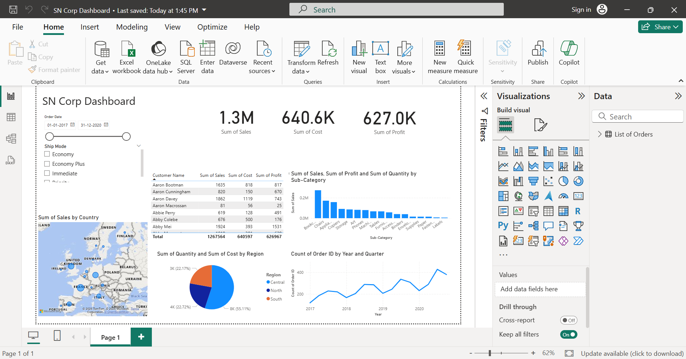

# 📊 Sales Dashboard – Power BI

This project presents a dynamic and interactive Sales Dashboard built using Microsoft Power BI.

## 🔍 Key Features
- Region-wise and monthly sales analysis
- KPIs: Revenue, Units Sold, Profit Margins
- Interactive filters for categories and regions
- Visual trendline for business performance

## 🛠 Tools Used
- Power BI
- Excel (Raw data preparation)

## 📥 Download Dashboard
[Click here to download the .pbix file](https://drive.google.com/uc?export=download&id=170VR4ABNIC9z6PY6fgJUuoS3eAQku2to)

## 📸 Screenshot Preview
*(Upload a screenshot named `SN Corp Dashboard 14-07-2025 14_10_05.png` in your repo and use below line)*

```md

